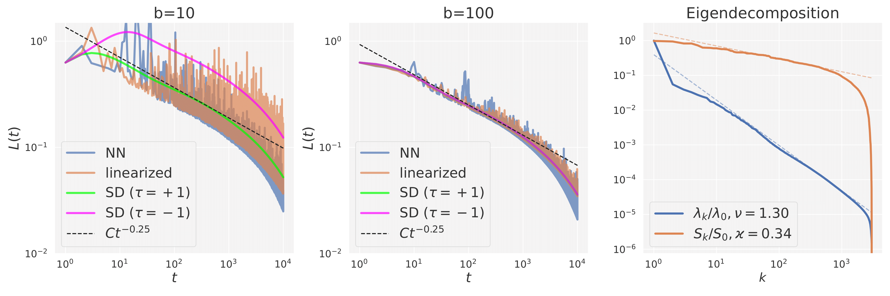

### Description
---

This repository accompanies the NeurIPS 2022 submission

"*A view of mini-batch SGD via generating functions:
conditions of convergence, phase transitions, benefit
from negative momenta.*"

 

### Structure of the repository
---

The repository contains the implementation of the 4 training regimes used in the paper:
* Training of real neural network (Fully-connected NN with 1 hidden layer)
* Linearized regime with stochastic sampling of batches
* Linearized regime with averaging over all possible batch samplings
* Spectral diagonal (SD) regime

#### Training scripts
```
train_nn.py - run SGD dynamics of single-layer neural network 
train_linearized.py - run SGD dynamics in linearized regime with stochastic sampling ofr batches
train_full.py - run SGD dynamics averaged over possible batch samplings
train_spectral_diagonal.py - run SGD dynamics in spectral diagonal approximation with arbitrary \tau
train_4_regimes.py - run SGD dynamics simultaneously in 4 regimes
train_4_regimes_serial.py - run SGD dynamics simultaneously in 4 regimes with a series of runs for training 1-layer neural network, in the linearized regime with stochastic sampling, and with the list of \tau parameters.
```
#### Notebooks

Notebooks are located in `./notebooks` directory
```
BudgetIndependence.ipynb - for plotting the results of experiments on budget indepence
RegimeComparison.ipynb - comparsion with different regimes mentioned in the paper
RegimeComparisonSerial.ipynb - comparsion with running of series of runs for sampling
SGD_generating_funcs.ipynb - notebooks with the symbolic computations used in the work (we suggest to run it on colab)
```

### Environment
---

All experiments were run in the `conda` environment with the following versions of packages installed 

```
pytorch == 1.11.0
functorch == 0.1.1
seaborn == 0.11.2
matplotlib == 3.5.1
sympy == 1.7.1
```

Version of `pytorch>=1.11.0` + `functorch` is needed for efficient computation of NTK. 


### Datasets used
---
In this work we have used following datasets
* [MNIST](http://yann.lecun.com/exdb/mnist/) dataset from [torchvision](https://pytorch.org/vision/main/generated/torchvision.datasets.MNIST.html)
* [Bike sharing dataset](https://archive.ics.uci.edu/ml/datasets/Bike+Sharing+Dataset) from UCI Machine Learning Repository
* [SGEMM GPU kernel performance dataset](https://archive.ics.uci.edu/ml/datasets/SGEMM+GPU+kernel+performance) from UCI Machine Learning Repository
* Synthetic datasets with specific exponents $\nu$ and $\varkappa$ for power-law decay 

All data for the experiments is expected to be stored at `./data` directory.


To reproduce the experiments in the paper download the datasets and extract into the  `./data`  directory. 
```
mkdir -p data/Bike-Sharing data/sgemm_product
cd data/Bike-Sharing
wget https://archive.ics.uci.edu/ml/machine-learning-databases/00275/Bike-Sharing-Dataset.zip
unzip Bike-Sharing-Dataset.zip
cd ../sgemm_product
wget https://archive.ics.uci.edu/ml/machine-learning-databases/00440/sgemm_product_dataset.zip
unzip sgemm_product_dataset.zip
```

### Usage
---

To run series of experiments for different configuration of parameters provide a list of parameters to the following flags:
```
--lr (learning rate)
--momentum (momentum) 
--batch_size (batch size)
```
By default if list of parameters is provided for each of these arguments experiments will be run with all possible combintations of these parameters. If one would like to run only a single run for a pair of these parameters provide explicitly flag `--aggr_type zip`. Note, that in this case lengths of arguments have to be equal to each other or to 1. 

